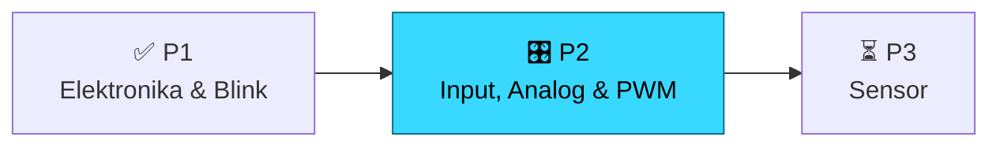
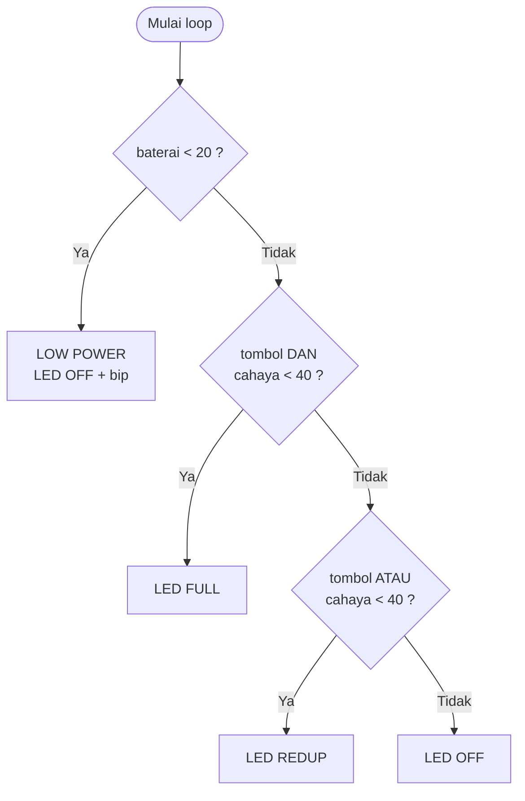
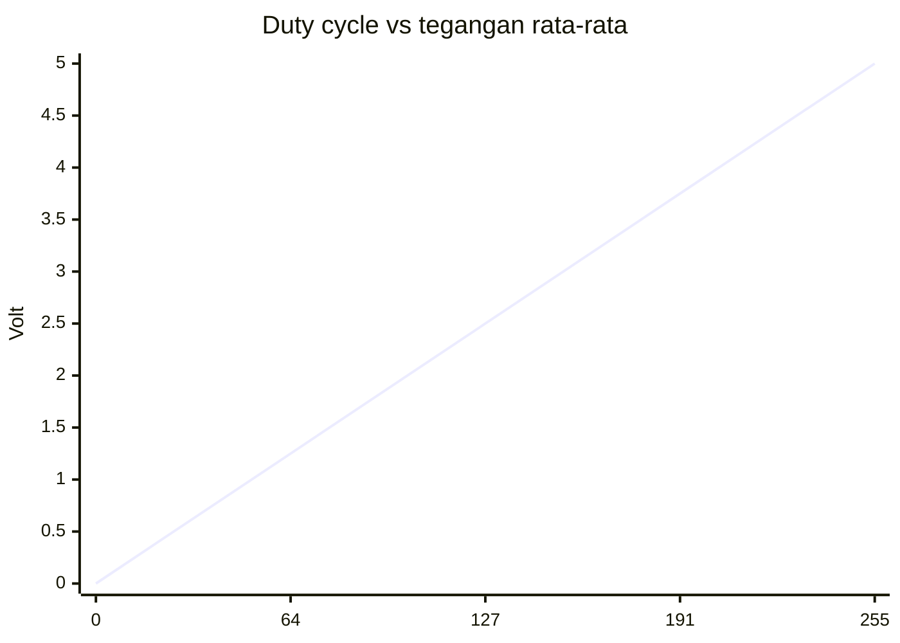
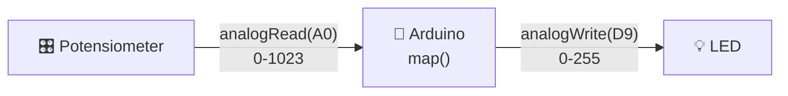

<div align="center">

# 🎛️ Pertemuan 2 · Input, Analog & PWM

**BiProTik Robotics Lab · Buana Perjuangan Robotic Club**


[⬅️ Pertemuan 1](https://bproticp1.vercel.app/) · [🔀 If/Else](#1️⃣-if--else-bertingkat) · [〰️ Analog](#2️⃣-analog-vs-digital) · [📈 PWM](#4️⃣-pwm--pulse-width-modulation) · [🔌 Dimmer](#5️⃣-mini-project--dimmer-led) · [⚔️ Challenge](#️-challenge--mission-kelompok)

</div>

---

## 🎯 Target Hari Ini

Setelah pertemuan ini, kamu bisa:

- [ ] Membuat keputusan bertingkat dengan `if / else if / else` dan operator `&&`, `||`
- [ ] Menjelaskan beda sinyal **digital** dan **analog**
- [ ] Membaca potensiometer dengan `analogRead()` dan memahami ADC
- [ ] Mengatur kecerahan LED dengan **PWM** (`analogWrite`) dan membaca bentuk gelombangnya
- [ ] Memakai **Serial Monitor** untuk melihat data dan melakukan debugging



> [!NOTE]
> **Recap P1:** elektronika dasar, wiring LED, struktur `setup()`/`loop()`, blink, input digital, dan tugas traffic light 3 persimpangan. Pertemuan ini langsung naik level.

## 📑 Daftar Isi

1. [If / Else Bertingkat](#1️⃣-if--else-bertingkat)
2. [Analog vs Digital](#2️⃣-analog-vs-digital)
3. [Potensiometer](#3️⃣-potensiometer)
4. [PWM](#4️⃣-pwm--pulse-width-modulation)
5. [Mini Project: Dimmer LED](#5️⃣-mini-project--dimmer-led)
6. [Serial Monitor](#6️⃣-serial-monitor)
7. [Quiz](#-quiz-cepat)
8. [Challenge & Mission Kelompok](#️-challenge--mission-kelompok)
9. [Komponen](#-komponen-pertemuan-ini) · [Troubleshooting](#-troubleshooting)

---

## 1️⃣ If / Else Bertingkat

Satu keputusan bisa punya banyak cabang dan banyak syarat.



```cpp
if (baterai < 20) {
  // LOW POWER
} else if (tombol && cahaya < 40) {
  // LED FULL
} else if (tombol || cahaya < 40) {
  // LED REDUP
} else {
  // LED OFF
}
```

| Operator | Arti | Contoh | Hasil |
|:--------:|------|--------|:-----:|
| `&&` | DAN, kedua sisi harus true | `true && false` | `false` |
| `\|\|` | ATAU, salah satu cukup | `true \|\| false` | `true` |
| `!` | NOT, membalik nilai | `!true` | `false` |
| `==` | sama dengan | `5 == 5` | `true` |
| `!=` | tidak sama | `5 != 5` | `false` |
| `<` `>` `<=` `>=` | perbandingan | `3 >= 3` | `true` |

> [!IMPORTANT]
> **Urutan penulisan = prioritas.** Program membaca dari atas dan berhenti di cabang pertama yang benar. Taruh kondisi paling kritis (darurat, baterai habis) di paling atas.

> [!WARNING]
> `if (x = 5)` bukan membandingkan, tapi **mengisi** x dengan 5 (hasilnya selalu true). Pakai `==`.

<details>
<summary>🧪 <b>Trace sendiri #1</b> (klik untuk lihat jawaban)</summary>

```cpp
int x = 5, a;
if (x > 3 && x < 5) a = 1;
else if (x >= 5)    a = 2;
else                a = 3;
// a = ?
```

**Jawaban: `a = 2`.** Cabang pertama salah (x tidak < 5), cabang kedua benar, sisanya dilewati.

</details>

<details>
<summary>🧪 <b>Trace sendiri #2: short-circuit</b></summary>

```cpp
int a = 4, b = 0;
if (a > 3 || b++ > 0) { }
// b = ?
```

**Jawaban: `b = 0`.** Sisi kiri sudah true, jadi sisi kanan (`b++`) tidak pernah dievaluasi.

</details>

<details>
<summary>🧪 <b>Trace sendiri #3: nested</b></summary>

```cpp
int t = 35, h = 80, m;
if (t > 30) { if (h > 70) m = 3; else m = 2; }
else m = 1;
// m = ?
```

**Jawaban: `m = 3`.** Masuk blok luar (t > 30), lalu blok dalam (h > 70).

</details>

---

## 2️⃣ Analog vs Digital

| | Digital | Analog |
|---|---|---|
| Nilai | 2 keadaan: `HIGH` (5V) / `LOW` (0V) | Kontinu, 0 sampai 5V |
| Contoh | Tombol, LED on/off | Potensiometer, sensor cahaya, sensor suhu |
| Fungsi Arduino | `digitalRead()` / `digitalWrite()` | `analogRead()` / `analogWrite()` (PWM) |

Arduino hanya mengerti angka, jadi tegangan analog diubah oleh **ADC (Analog to Digital Converter)**:

| Spesifikasi ADC Uno | Nilai |
|---------------------|-------|
| Resolusi | 10-bit → 2¹⁰ = **1024 level** |
| Rentang `analogRead()` | **0 – 1023** |
| Tegangan referensi | 5V |
| Satu level | 5V / 1024 ≈ **4,88 mV** |
| Pin | **A0 – A5** saja |

```cpp
int   nilai = analogRead(A0);          // 0 - 1023
float volt  = nilai * 5.0 / 1023.0;    // konversi ke Volt
```

| Tegangan masuk | `analogRead()` |
|:--------------:|:--------------:|
| 0 V | 0 |
| 1,25 V | ≈ 256 |
| 2,5 V | ≈ 512 |
| 3,75 V | ≈ 767 |
| 5 V | 1023 |

> [!NOTE]
> Pin digital D0–D13 **tidak bisa** `analogRead()`. Gunakan A0–A5.

---

## 3️⃣ Potensiometer

Resistor yang nilainya bisa diputar. Punya **3 kaki**:

```
   ┌───────┐
   │  ( )  │   knob
   └─┬─┬─┬─┘
     │ │ │
    5V │ GND
       └── kaki tengah (wiper) → A0
```

Memutar knob menggeser wiper sehingga tegangan keluarannya berubah dari 0V ke 5V (prinsip *voltage divider*):

$$V_{out} = V_{in} \times \frac{R_2}{R_1 + R_2}$$

> [!NOTE]
> Kaki ujung (5V dan GND) tertukar tidak merusak apa-apa, hanya arah putarnya yang terbalik. Yang wajib benar: **kaki tengah ke A0**.

---

## 4️⃣ PWM · Pulse Width Modulation

Arduino Uno tidak punya output analog asli. PWM menyalakan dan mematikan pin **sangat cepat** (± 490 Hz, pin 5 & 6 ± 980 Hz). Mata hanya melihat **rata-rata**-nya.

**Duty cycle** = persen waktu ON dalam satu periode. **Tegangan rata-rata = duty × 5V.**

| `analogWrite(pin, n)` | Duty | Tegangan rata-rata | Bentuk gelombang |
|:---------------------:|:----:|:------------------:|------------------|
| `0` | 0% | 0 V | `░░░░░░░░░░░░░░░░` |
| `64` | 25% | 1,25 V | `█░░░█░░░█░░░█░░░` |
| `127` | 50% | 2,5 V | `██░░██░░██░░██░░` |
| `191` | 75% | 3,75 V | `███░███░███░███░` |
| `255` | 100% | 5 V | `████████████████` |

> `█` = ON (5V) · `░` = OFF (0V)



> [!IMPORTANT]
> `analogWrite()` hanya bekerja di pin bertanda **~**: **3, 5, 6, 9, 10, 11**. Pin lain tidak menghasilkan efek PWM.

Mengubah rentang nilai dengan `map()`:

```cpp
int pwm = map(nilai, 0, 1023, 0, 255);   // 0-1023 diskalakan ke 0-255
```

| `nilai` (pot) | `pwm` | Duty |
|:------------:|:-----:|:----:|
| 0 | 0 | 0% |
| 256 | 63 | ≈ 25% |
| 512 | 127 | ≈ 50% |
| 1023 | 255 | 100% |

---

## 5️⃣ Mini Project · Dimmer LED

Putar potensiometer, kecerahan LED mengikuti.



**Rangkaian**

| Komponen | Kaki | Arduino |
|----------|------|---------|
| Potensiometer | Kiri | `5V` |
| | Tengah (wiper) | `A0` |
| | Kanan | `GND` |
| Resistor 220Ω | Satu ujung | `D9` |
| LED | Anoda (+) ← resistor, katoda (−) | `GND` |

<details>
<summary>💻 <b>Kode lengkap</b></summary>

```cpp
const int POT = A0;
const int LED = 9;   // pin PWM (~)

void setup() {
  Serial.begin(9600);
}

void loop() {
  int nilai = analogRead(POT);              // 0 - 1023
  int pwm   = map(nilai, 0, 1023, 0, 255);  // skala ke 0 - 255
  analogWrite(LED, pwm);

  Serial.print("Pot: ");
  Serial.print(nilai);
  Serial.print(" | PWM: ");
  Serial.println(pwm);
  delay(50);
}
```

</details>

**Tambahan: tombol on/off.** Dengan `INPUT_PULLUP`, tombol cukup 1 kaki ke D2 dan 1 kaki ke GND (ditekan = `LOW`).

<details>
<summary>💻 <b>Kode dimmer + tombol</b></summary>

```cpp
const int POT = A0, LED = 9, BTN = 2;

void setup() {
  pinMode(BTN, INPUT_PULLUP);
  Serial.begin(9600);
}

void loop() {
  int pwm = map(analogRead(POT), 0, 1023, 0, 255);

  if (digitalRead(BTN) == LOW) analogWrite(LED, pwm);  // ditekan = aktif
  else                          analogWrite(LED, 0);

  Serial.println(pwm);
  delay(50);
}
```

</details>

---

## 6️⃣ Serial Monitor

Arduino tidak punya layar. Lewat USB ia mengirim teks ke komputer: **mata kita untuk melihat isi kepala Arduino.**

| Fungsi | Kegunaan |
|--------|----------|
| `Serial.begin(9600)` | Mulai komunikasi (di `setup()`) |
| `Serial.print(x)` | Cetak tanpa pindah baris |
| `Serial.println(x)` | Cetak lalu pindah baris |

> [!TIP]
> Baud rate di kode (`9600`) harus **sama** dengan pilihan di pojok kanan bawah Serial Monitor. Kalau beda, yang muncul karakter acak. Cetak juga nama cabang if/else yang aktif supaya bug terlihat, bukan ditebak.

---

## 🧠 Quiz Cepat

<details>
<summary><b>1.</b> Rentang nilai <code>analogRead()</code> pada Uno?</summary>

**0 – 1023.** ADC 10-bit menghasilkan 1024 level.
</details>

<details>
<summary><b>2.</b> <code>analogWrite(9, 127)</code> menghasilkan duty cycle kira-kira?</summary>

**50%.** 127/255 ≈ 0,5 sehingga tegangan rata-rata ± 2,5V.
</details>

<details>
<summary><b>3.</b> Kaki potensiometer mana yang dihubungkan ke A0?</summary>

**Kaki tengah (wiper).** Itu keluaran tegangan yang berubah.
</details>

<details>
<summary><b>4.</b> Kenapa <code>analogWrite()</code> tidak berefek di pin 12?</summary>

Pin 12 **bukan pin PWM**. PWM hanya di pin 3, 5, 6, 9, 10, 11.
</details>

<details>
<summary><b>5.</b> PWM duty 25% pada 5V, tegangan rata-ratanya?</summary>

**1,25 V** (0,25 × 5V).
</details>

<details>
<summary><b>6.</b> x = 4. Cabang mana yang jalan? <code>if(x>5){A} else if(x>2){B} else{C}</code></summary>

**B.** `x>5` salah, `x>2` benar, sisanya dilewati.
</details>

<details>
<summary><b>7.</b> Serial Monitor menampilkan karakter acak. Penyebab paling mungkin?</summary>

**Baud rate berbeda** antara `Serial.begin()` dan pengaturan Serial Monitor.
</details>

---

## ⚔️ Challenge & Mission Kelompok

Dikerjakan **per kelompok**. Tunjukkan hasilnya ke mentor untuk dicek langsung.

### Challenge

- [ ] **Dimmer Kelompok** (100 XP): rakit dimmer LED dengan potensiometer di D9, lalu jelaskan kenapa harus pin bertanda `~`.
- [ ] **Fade Otomatis** (150 XP): tanpa potensiometer, buat LED naik-turun terang memakai `for` loop + `analogWrite`.
- [ ] **Tiga Zona Terang** (150 XP): bagi pot jadi 3 zona dengan `else if` (redup / sedang / terang) dan tampilkan zona di Serial.

<details>
<summary>💡 <b>Hint Fade Otomatis</b></summary>

```cpp
for (int i = 0; i <= 255; i++) { analogWrite(LED, i); delay(5); }   // naik
for (int i = 255; i >= 0; i--) { analogWrite(LED, i); delay(5); }   // turun
```

</details>

### 🏆 Final Mission · Traffic 3 Simpang v2

Upgrade tugas traffic light 3 persimpangan dari P1:

- [ ] Durasi hijau diatur **potensiometer** (`analogRead` + `map`)
- [ ] Prioritas dengan `if / else if / else` (mode darurat paling atas)
- [ ] Tombol darurat membuat satu simpang hijau, yang lain merah
- [ ] Semua status dan durasi dicatat ke **Serial Monitor**

> 🚀 **Teaser Pertemuan 3:** nanti lampu hijau bisa diperpanjang otomatis oleh **sensor jarak HC-SR04** saat ada antrean kendaraan.

---

## 🧰 Komponen Pertemuan Ini

| Komponen | Jumlah / orang |
|----------|:--------------:|
| Arduino Uno / Nano + kabel USB | 1 |
| Breadboard + kabel jumper | 1 set |
| LED 5mm (merah, kuning, hijau) | secukupnya |
| Resistor 220Ω | secukupnya |
| Potensiometer 10kΩ | 1 |
| Push button | 1 |

---

## ❓ Troubleshooting

> Urutan debug: **kabel → kode → komponen**. Jangan langsung ganti board.

<details>
<summary>💡 <b>LED tidak berubah terang saat knob diputar</b></summary>

- Pin LED bukan pin PWM. Pindahkan ke **3, 5, 6, 9, 10, atau 11**.
- Kaki tengah potensiometer belum ke `A0`.

</details>

<details>
<summary>💡 <b>Serial Monitor menampilkan 0 terus / 1023 terus</b></summary>

- Kaki 5V atau GND potensiometer lepas.
- Kaki tengah tidak tersambung ke `A0`.

</details>

<details>
<summary>💡 <b>Serial Monitor menampilkan karakter acak</b></summary>

Baud rate tidak sama. Samakan `Serial.begin(9600)` dengan pilihan di Serial Monitor.

</details>

<details>
<summary>💡 <b>LED tidak menyala sama sekali</b></summary>

- Polaritas terbalik: kaki **panjang (anoda)** ke arah resistor/pin, kaki pendek ke GND.
- Resistor tidak seri dengan LED.
- GND tidak tersambung.

</details>

<details>
<summary>💡 <b>Tombol seperti terbalik (ditekan = LED mati)</b></summary>

Dengan `INPUT_PULLUP`, logikanya terbalik: tidak ditekan = `HIGH`, ditekan = `LOW`. Cek kondisinya pakai `== LOW`.

</details>

---

<div align="center">

**THINK. CODE. CONTROL.**

*Dibuat dengan ⚡ oleh Divisi Robotik · Buana Perjuangan Robotic Club*

</div>
